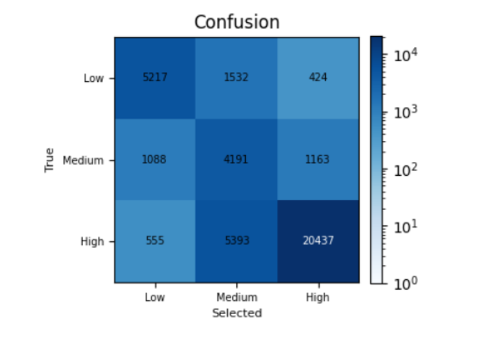
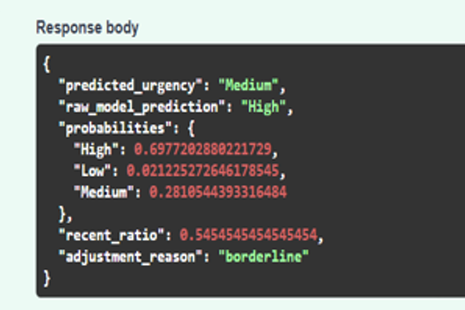

# PriorityLens-Seeing-Beyond-Predictions

PriorityLens does not rely solely on model predictions. A dedicated validation layer evaluates behavioral consistency and activity signals to distinguish between users who appear urgent and users who demonstrate genuine need, improving decision reliability in borderline cases.

## Features

- Random Forest urgency classification
- Behavioral feature analysis
- Business-rule validation layer
- Detection of overestimated urgency levels
- Identification of genuinely high-need users
- Priority ranking and decision support

## Tech Stack

- Python
- Pandas
- NumPy
- Scikit-Learn
- FastAPI
- Swagger UI

## Workflow

1. User behavioral data collection
2. Feature extraction and preprocessing
3. Urgency prediction using Random Forest
4. Validation against business rules and activity patterns
5. Detection of potential urgency overestimation
6. Identification of genuinely high-priority users
7. Final priority assignment

## Deployment

The model was deployed using **FastAPI** as a RESTful API service.

### Features:
- REST API for inference
- Swagger UI for interactive testing
- JSON input/output format
- Real-time predictions

### API Documentation:
Run locally and visit:
`http://127.0.0.1:8000/docs`

## Results

### Confusion Matrix

### Validation Example

